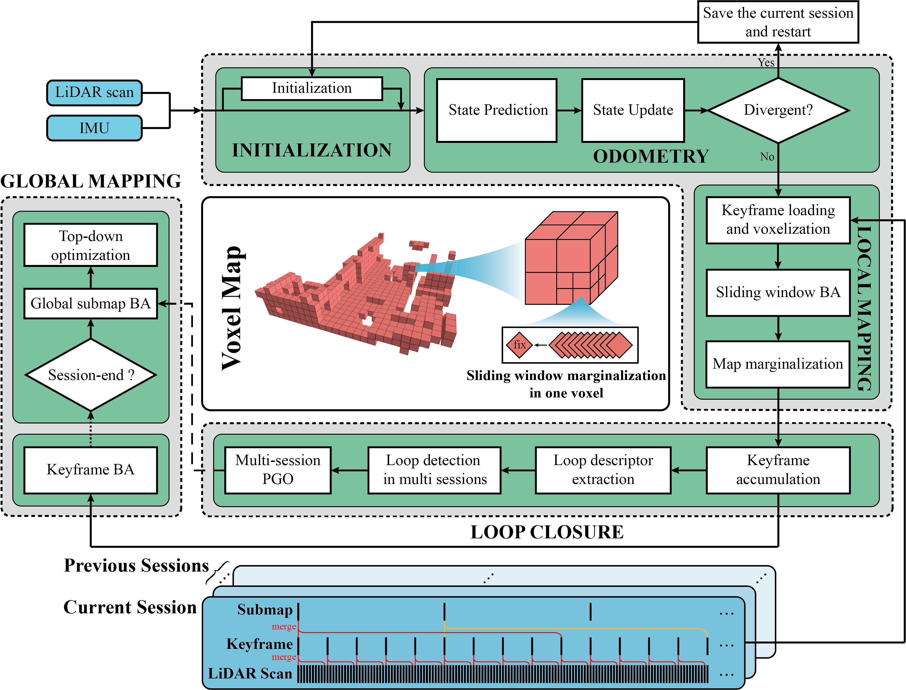

# Voxel-SLAM: A Complete, Accurate, and Versatile LiDAR-Inertial SLAM System

Voxel-SLAM is a complete, accurate, and versatile LiDAR-inertial SLAM system that fully utilizes short-term, mid-term, long-term, and multi-map data associations. It includes five modules: initialization, odometry, local mapping, loop closure, and global mapping. The initialization can provide accurate states and local map in a static or dynamic initial state. The odometry estimates current states and detect potential system divergence. The local mapping refine the states and local map within the sliding window by a LiDAR-inertial BA. The loop closure can detect in multiple sessions. The global mapping refine the global map with an efficient hierarchical global BA. The system overview is:

